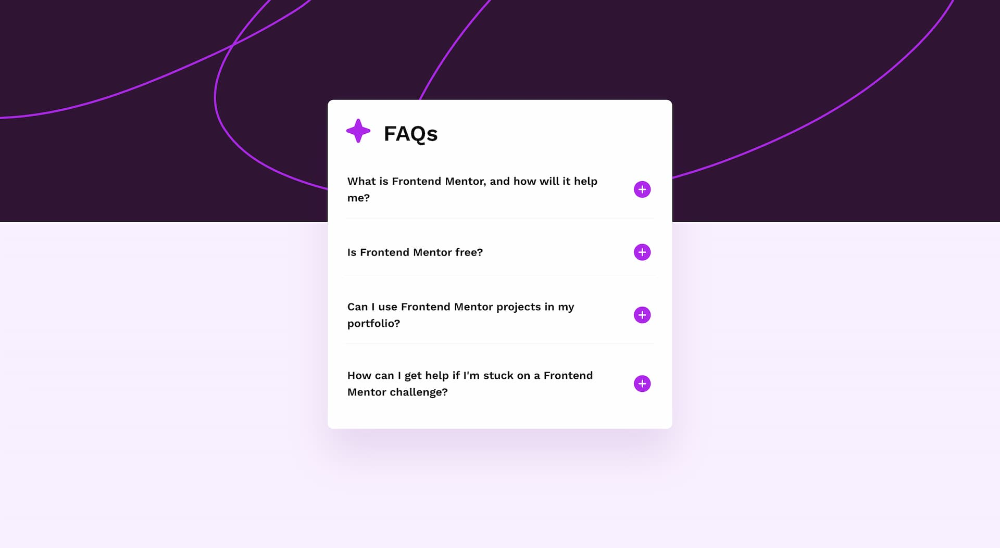

# Frontend Mentor - FAQ accordion solution

This is a solution to the [FAQ accordion challenge on Frontend Mentor](https://www.frontendmentor.io/challenges/faq-accordion-wyfFdeBwBz). Frontend Mentor challenges help you improve your coding skills by building realistic projects.

## Table of contents

- [Overview](#overview)
  - [The challenge](#the-challenge)
  - [Screenshot](#screenshot)
  - [Links](#links)
- [My process](#my-process)
  - [Built with](#built-with)
  - [What I learned](#what-i-learned)
  - [Continued development](#continued-development)
  - [Useful resources](#useful-resources)
- [Author](#author)
- [Acknowledgments](#acknowledgments)

## Overview

### The challenge

Users should be able to:

- Hide/Show the answer to a question when the question is clicked
- Navigate the questions and hide/show answers using keyboard navigation alone
- View the optimal layout for the interface depending on their device's screen size
- See hover and focus states for all interactive elements on the page

### Screenshot



### Links

- Solution URL: [Add solution URL here](https://your-solution-url.com)
- Live Site URL: [Add live site URL here](https://your-live-site-url.com)

## My process

### Built with

- Semantic HTML5 markup
- CSS custom properties
- Flexbox
- CSS Grid
- Mobile-first workflow

### What I learned

How to implement an accessible accordion following the accordion pattern from APG (ARIA Authoring Practices Guide).

**Keyboard support**

- Space or Enter: When focus is on the accordion header of a collapsed section, expands the section
- Tab: Moves focus to the next focusable element.
- Shift + Tab: Moves focus to the previous focusable element

**Roles and properties**

- li and button: I've put the faqs in a unordered list so it can announce the number of items.

- `aria-expanded="true"`: Set to true when the panel is expanded, otherwise set to false.
- `aria-controls="ID"`: Points to the ID of the panel which the header controls.
- `aria-labelledby="IDREF"`: Define the accessible name for the region element. Reference the accordion header button that expands and collapse the region. Region elements are required to have an accessible name to be identified as a landmark.

**No-script**
I added a `<noscript></noscript>` part so when the page loads with javaScript deactivated, all the faqs are expanded and readable.

```html
<noscript>
  <style>
    [data-state="no-js"] .faq__button[aria-expanded="false"] + .faq__answer {
      display: block;
      opacity: 1;
    }
  </style>
</noscript>
```

The list items have a default data attribute of "no-script" and the buttons are disabled by default.
When the javaScript loads, it update the data attributes to "ready" and activate the buttons.

### Continued development

Add small animations for the faqs open and close.

### Useful resources

Learn about the accordion pattern - [https://www.w3.org/WAI/ARIA/apg/patterns/accordion/](https://www.w3.org/WAI/ARIA/apg/patterns/accordion/)
Learn how to build an accessible disclosure - [https://fedmentor.dev/posts/disclosure-ui/](https://fedmentor.dev/posts/disclosure-ui/)

## Author

- Website - [Gwenaël Magnenat](https://gmagnenat.com)
- Frontend Mentor - [@gmagnenat](https://www.frontendmentor.io/profile/gmagnenat)
- LinkedIn - [@gmagnenat](https://www.linkedin.com/in/gmagnenat)
